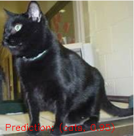
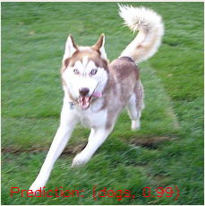

# Intro to Image Classification with Tensorflow

Program to build, train and test of image classification models. 

Supported models:
- AlexNet 
- VGG16
- Inception (In progress)

You can also implement your own model using the layer and module wrappers, and add more wrappers as you need them. 

The API allows to perform end-to-end training, fine-tuning and restoring a training process. To test the model use the test.py

## Requirements and installation

This code has been implemented / tested / maintained with:
- OpenCV >= 3.4
- Python 3.6
- Tensorflow == 1.14.0

Installing a virtual environment using python3 using zsh:
```
	sudo pip3 install virtualenv virtualenvwrapper
	echo "# Virtual Environment Wrapper"  >> ~/.zshrc
	echo "source /usr/local/bin/virtualenvwrapper.sh" >> ~/.zshrc
	source ~/.zshrc
```

Create virtual environment with python3:
```
	mkvirtualenv classifier -p python3
```

Test python version on virtual enviornment:
```
	workon classifier
	python -V
	deactivate
```

Also, I provided a list of requirements, which you can install as follows: 
```
	workon classifier
	pip install -r requirements.txt
```

Note: OpenCV is not included in these requirements. I follow this [tutorial](https://www.learnopencv.com/install-opencv3-on-ubuntu/) to install it, except I used version 3.4.

## Tools

In the tools folder, I provided a set of scripts data preprocessing. Such scripts 
allow to;
 - Download images based on Google search queries
 - Remove repeated files
 - Rename files
 - Crop images
 - Delete images 
 - Split a dataset into train set and test set
 - Perform off-line data augmentation

Below, I show usage examples:

#### Download data 
This script is used to perform an automatic dataset download using the 
[google-images-download package](https://github.com/hardikvasa/google-images-download ). 
This script allows to download multiple datasets at a time, by providing a comma separated
set of keywords. To use it, run:

To use it, run:
```
	python tools/data_gdownload.py --outpath path/to/output/data --keywords kw1,kw2,... --prefixes superhero --limit 20000 --chrome /usr/lib/chromium-browser/chromedriver
```

#### Pre-process data
The script pre_process_data.py allows to review a dataset from a given folder. It
allows to select a region of interest on the image and only keep that region. Also, 
it allows to delete unnecessary images. To use it run:
```
	python tools/data_preprocess.py --inpath path/to/input/data
```

#### Removed repeated 
This script is useful when using the google-image-download multiple times for 
similar queries. The package might download the same image several times but with 
different indexes. The script will remove the repeated images. To use it, run:
```
	python tools/data_rmrepeated.py --inpath path/to/input/data
```

#### Rename 
This script is used to rename all files in an input directory. It uses a basename
provided by the user and adds current date and hour to the filename to avoid
overwriting. To use it, run:
```
	python tools/data_rename.py --inpath data/superhero/flash --name flash
```

## Training 
This code supports different types of training:
 - End-to-end training
 - Finetuning from pre-trained model
 - Restoring a training model 

## End-to-end training 
```
	workon classifier
  python classifier/train.py --data path/to/training/data --max_iter 20000 --gpu 0
```

### Finetune
```
	workon classifier
	python clasifier/train.py --data path/to/training/data --max_iter 20000 --gpu 0 --finetune
```

### Restore
```
	workon classifier
	python clasifier/train.py --data path/to/training/data --max_iter 20000 --gpu 0 --restore --model_path path/to/model/to/restore
```

## Visualize training in Tensorboard
```
	workon classifier
	tensorboard --logdir=/path/to/logs
```

Al abrir en la dirección de loopback (e.g. http://127.0.1.1:6006) indicada por TensorBoard, se observarán gráficas como las siguientes:

### Accuracy
<p align="center"> </p>

### Loss
<p align="center"> </p>

## Arquitectura actual del clasificador
<p align="center"> </p>

### Test the models
To test and visualize predictions:
```
	workon classifier
	python classifier/test.py --data path/to/testing/data --model_path path/to/test/model --watch 1
```
And you'll see predictions like:
<p align="center"> </p>
<p align="center"> </p>

To test and only see accuracy metrics
```
	workon classifier
	python classifier/test.py --data path/to/testing/data --model_path path/to/test/model
```