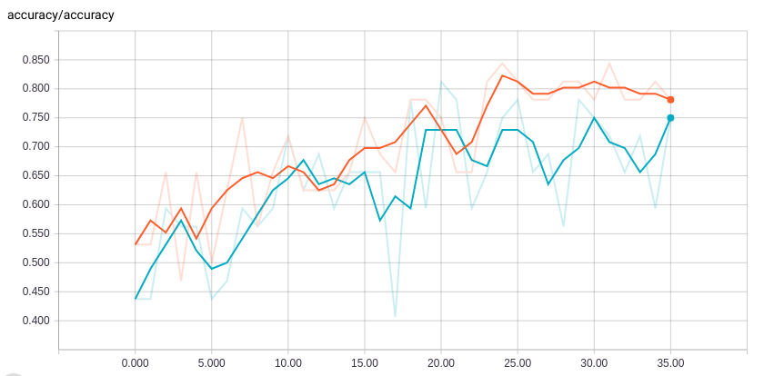
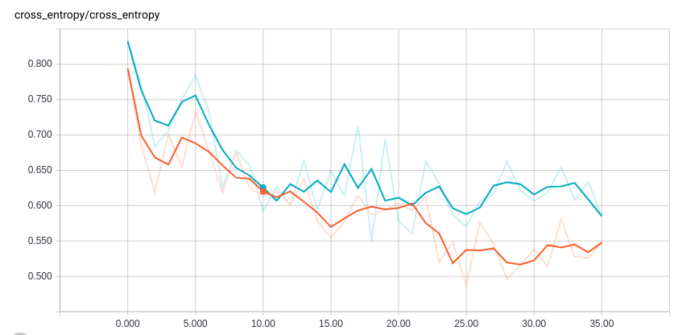
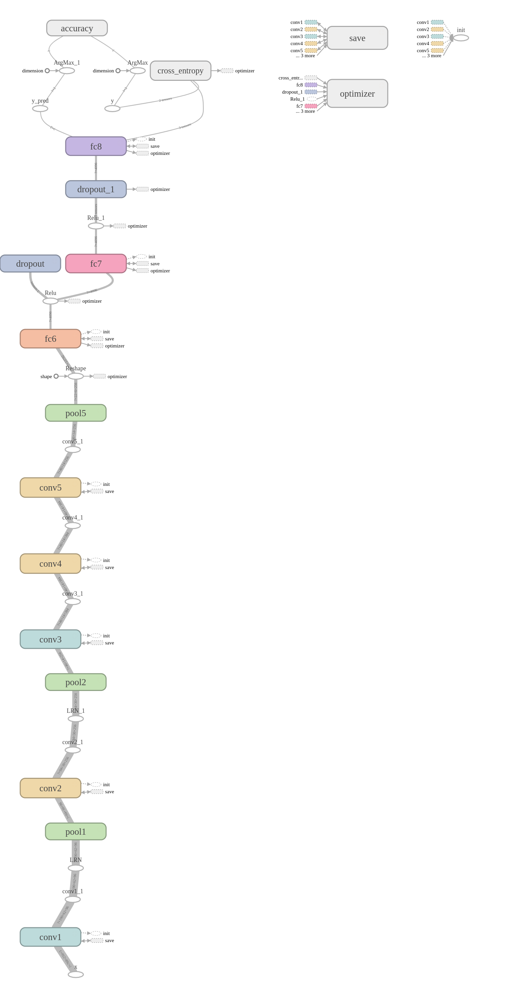

# Clasificador de imagenes con Tensorflow 

# Requerimientos

# Descripcion 

# Dataset

### Dividir dataset 

# Clasificador
### Instalación de requerimientos en ambiente virtual 

Instalar ambiente virtual usando python3:
```
	sudo pip3 install virtualenv virtualenvwrapper
	echo "# Virtual Environment Wrapper"  >> ~/.bashrc
	echo "source /usr/local/bin/virtualenvwrapper.sh" >> ~/.bashrc
	source ~/.bashrc
```
Crear ambiente virtual usando python3:
```
	mkvirtualenv tf-classifier -p python3
	workon tf-classifier
```

Activar ambiente virtual y verificar que la versión sea correcta:
```
	workon tf-classifier
	python -V
```

Desactivar ambiente virtual y verificar que la versión sea correcta:
```
	deactivate
```

Installar Tensorflow:
```
	pip install -r requirements.txt
```

### Entrenamiento de la red (end-to-end)
```
	workon tf-classifier
  python src/classifier/train.py --data path/to/training/data --max_iter 20000 --gpu 0 --restore 0 --fintune 0
```

### Finetunning de la red
```
	workon tf-classifier
	python src/train.py --data path/to/training/data --max_iter 20000 --gpu 0 --restore 0 --fintune 1
```

### Restaurar entrenamiento de la red
```
	workon tf-classifier
	python src/train.py --data path/to/training/data --max_iter 20000 --gpu 0 --restore 1
```

### Visualización de entrenamiento 
```
	workon tf-classifier
	tensorboard --logdir=log
```

### Prueba de modelo entrenado
```
	workon tf-classifier
	python src/test.py --data path/to/testing/data --meta path/to/model
```

Al abrir en la dirección de loopback (e.g. http://127.0.1.1:6006) indicada por TensorBoard, se observarán gráficas como las siguientes:

### Accuracy
<p align="center"> </p>

### Loss
<p align="center"> </p>

## Arquitectura actual del clasificador
<p align="center"> </p>


### TODOS:
-[x] Implementar Alexnet 
-[x] Implementar VGG16 con entrenamiento end-to-end, restore y finetuning 
-[ ] Implementar ResNet con entrenamiento end-to-end, restore y finetuning 
-[ ] Implementar Inception con entrenamiento end-to-end, restore y finetuning 
-[ ] Implementar SqueezeNet con entrenamiento end-to-end, restore y finetuning 
-[ ] Conseguir modelo pre-entreando para Inception, ResNet y SqueezeNet
-[ ] Implementar finetuning para Inception
-[ ] Documentacion de codigo - wiki
-[ ] Agregar bash scripts para correr pruebas las redes
-[ ] Agregar funcionalidad de entrenamiento multiescala 